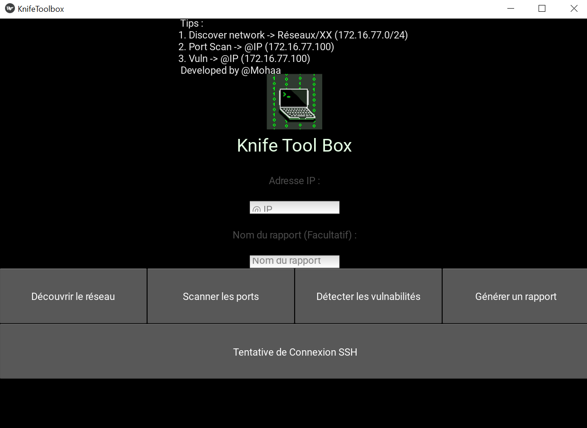
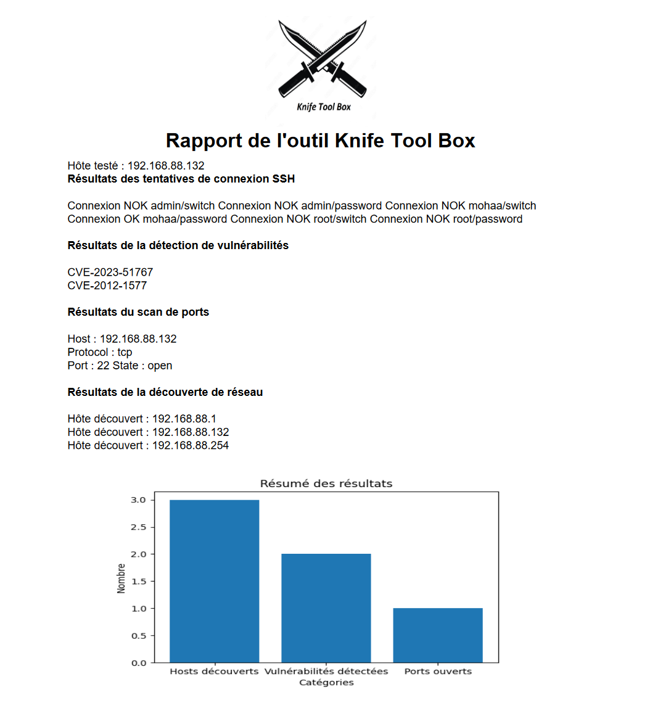

# 🗡️ Knife Tool Box

Knife Tool Box est une application Kivy développée dans le cadre d'un projet de Master 1 en Cyber Sécurité. Cette application permet de découvrir le réseau, de scanner les ports, de détecter les vulnérabilités et de générer des rapports détaillés sur les résultats.

## 🚀 Fonctionnalités

- Découverte de réseau : Permet de découvrir les hôtes actifs dans un réseau spécifié en scannant un réseau `(ex 192.168.88.0/24)`
- Scan de ports : Permet de scanner les ports ouverts sur une adresse IP spécifique. `(ex 192.168.88.132)`
- Détection de vulnérabilités : Utilise nmap pour détecter les vulnérabilités sur une adresse IP. `(ex 192.168.88.132)`
- Tentative de connexion SSH: Tente d'initier une connexion SSH par password guessing (login/password par défaut)
- Génération de rapport : Génère un rapport PDF contenant les résultats des opérations précédentes. Le rapport fournis un graph permettant la visualisation des résultats. `Tips : Les vulnérabilités détectés renvoie via un clic vers une page WEB du CVE.`

## 🔧 Prérequis

- Python 3.x
- Kivy
- nmap
- matplotlib
- reportlab
- paramiko

## 🛠️ Installation

1. Clonez le dépôt :

    ```
    git clone https://github.com/mohaa404/KnifeToolBox.git
    ```

2. Installez les dépendances :

    ```
    cd KnifeToolBox
    pip install -r requirements.txt
    ```

3. Lancez l'application :

    ```
    python main.py
    ```

## 📋 Utilisation

1. Lancez l'application en exécutant `python main.py`.
2. Saisissez l'adresse IP que vous souhaitez analyser.
3. Utilisez les boutons pour effectuer les différentes opérations : découvrir le réseau, scanner les ports, détecter les vulnérabilités, initier une connexion SSH ou générer un rapport.
4. Les résultats seront affichés dans l'application et un rapport PDF sera généré dans le répertoire "Report"

## 📷 Aperçus 




## ✍️ Auteur

Développé par [Mohamed JEDDI M1 CYB B](https://github.com/mohaa404).

